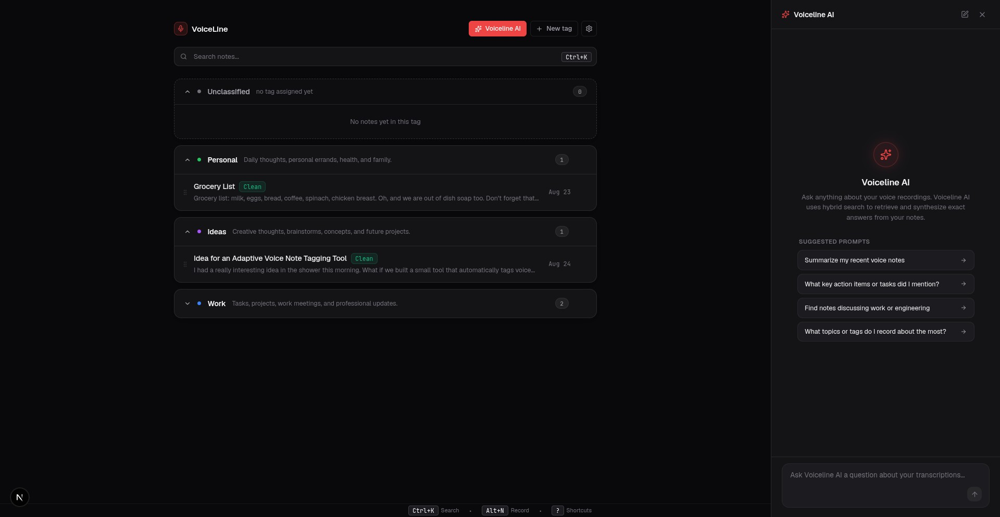

# VoiceLine

VoiceLine is an AI-powered voice-note workspace: record or upload audio, get it transcribed automatically, and let AI clean it up with titles, summaries, and auto-tags. Query across your entire library with **Voiceline AI** — an interactive RAG side panel powered by **dense + sparse hybrid search** with clickable note citations.

<p align="center">
  
  
</p>

## Key Features

- **Segmented Capsule Dock**: Record with hotkey `Alt+N`, live canvas audio visualizer, or drag-and-drop audio files anywhere.
- **Automated Note Processing**: Speech cleanup (removes filler words), Title Case auto-titling, bullet summaries (for 500+ word notes), and tag classification.
- **Voiceline AI Side Panel**: Conversational RAG assistant answering questions across your audio knowledge base with streaming responses and referenced note cards.
- **Hybrid RAG Search (Dense + Sparse RRF)**: Combines dense vector similarity (`pgvector` + HNSW cosine indexing) and full-text keyword rank (`ts_rank_cd`), fused via Reciprocal Rank Fusion (RRF).
- **Passage-Level Chunking**: Long notes are automatically sliced into semantic chunks (`recording_chunks`) for high-precision retrieval.
- **Clean Note Editor**: Raw vs. Clean transcript toggle, Markdown export, instant clipboard copy (`Alt+C`), and top-right word/char counts and save status.
- **Responsive Mobile Layout**: In-flow mobile bottom drawer dock with independent scrolling and zero text occlusion.

## How it works

1. **Record or upload** audio from the floating capsule dock.
2. **Transcribe** — audio is sent to OpenAI's transcription model and the raw transcript is persisted.
3. **Process & Index**:
   - generates a title if one was not set
   - summarizes into bullet points if the transcript is long (500+ words)
   - auto-assigns a tag from your existing tags
   - computes document-level and passage-level vector embeddings
4. **Organize & Search**:
   - notes are grouped by tag with drag-and-drop support (`dnd-kit`)
   - quick global search with `Ctrl+K`
   - ask questions to **Voiceline AI** for instant synthesized answers with source citations

Audio itself is not persisted — only transcripts, summaries, titles, tags, and embeddings are stored in Postgres (`lib/recordings/drizzle-store.ts`), keeping storage text-first and lightweight.

## Tech stack

- [Next.js 16](https://nextjs.org) (App Router) + React 19
- [Vercel AI SDK](https://sdk.vercel.ai/docs) (`ai`, `@ai-sdk/openai`, `@ai-sdk/react`)
- [Drizzle ORM](https://orm.drizzle.team) + PostgreSQL (`pgvector`)
- [TanStack Query](https://tanstack.com/query) for server state management
- [dnd-kit](https://dndkit.com) for drag-and-drop tag re-ordering
- [React Markdown](https://github.com/remarkjs/react-markdown) + [Remark GFM](https://github.com/remarkjs/remark-gfm)
- [Zod](https://zod.dev) for structured schema validations

## Getting started

### 1. Install dependencies

```bash
npm install
```

### 2. Configure environment

Copy the example env file and fill in your values:

```bash
cp .example.env .env.local
```

| Variable | Description | Default |
|---|---|---|
| `OPENAI_API_KEY` | Your OpenAI API key | *Required* |
| `DATABASE_URL` | PostgreSQL connection string | *Required* |
| `TRANSCRIBE_MODEL` | Model used for audio transcription | `gpt-4o-mini-transcribe` |
| `PROCESSING_MODEL` | Model used for title, summary & tag generation | `gpt-4o-mini` |
| `CHAT_MODEL` | Model used for Voiceline AI RAG responses | `gpt-4o-mini` |
| `EMBEDDING_MODEL` | Model used for dense vector embeddings | `text-embedding-3-small` |

### 3. Set up the database

Ensure PostgreSQL has the `vector` extension enabled, then push the schema:

```bash
npm run db:push
```

This creates the `tags`, `recordings`, and `recording_chunks` tables along with HNSW vector indexes.

### 4. Run the dev server

```bash
npm run dev
```

Open [http://localhost:3000](http://localhost:3000).

## Scripts

| Command | Description |
|---|---|
| `npm run dev` | Start the Next.js development server |
| `npm run build` | Build the application for production |
| `npm run start` | Start the production server |
| `npm run lint` | Run ESLint across the codebase |
| `npm run db:push` | Push schema changes directly to PostgreSQL |
| `npm run db:generate` | Generate SQL migration files from schema changes |

## Project structure

```
app/
  api/
    chat/                  # Voiceline AI RAG streaming endpoint
    transcribe/            # audio -> transcript + auto-processing
    recordings/[id]/process # manual note re-processing
    recordings/             # CRUD for notes & hybrid search
    tags/                   # CRUD for tags
  notes/[id]/               # note detail editor page
  page.tsx                  # main home workspace

components/
  AudioRecorder.tsx         # segmented capsule recorder dock
  VoicelineAISidePanel.tsx  # Voiceline AI RAG streaming chat panel
  TagGroup.tsx              # drag-and-drop tag groups
  TranscriptEditor.tsx      # transcript editor & top-right metadata
  TagModals.tsx             # tag creation & management modals
  ui/                       # reusable design primitives

hooks/
  useAudioRecorder.ts       # media stream recording & timer logic
  useAudioUpload.ts         # drag-drop & file picker audio upload logic
  useWaveformVisualizer.ts  # real-time canvas audio visualizer
  queries/                  # TanStack Query hooks (recordings, tags)

lib/
  ai/                       # AI processing, embeddings, prompts, chunking
  db/                       # Drizzle client, pgvector schema
  recordings/               # data access layer, hybrid search, types
  utils/                    # formatting & markdown export helpers
```
