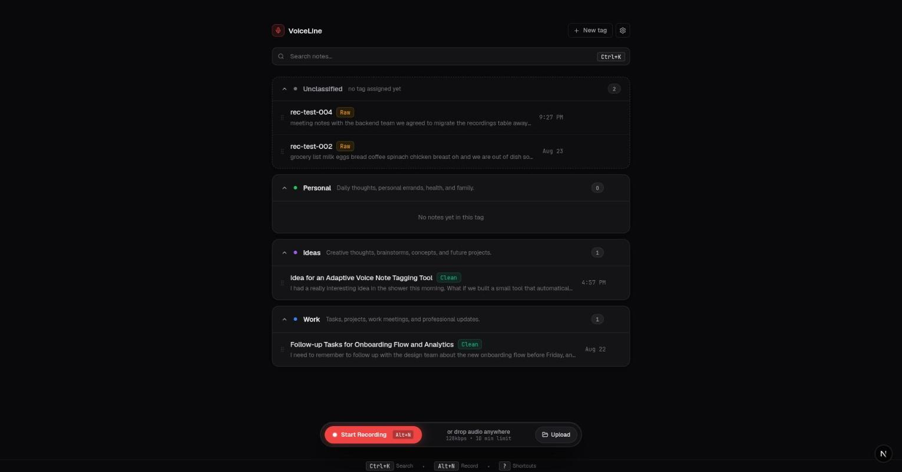
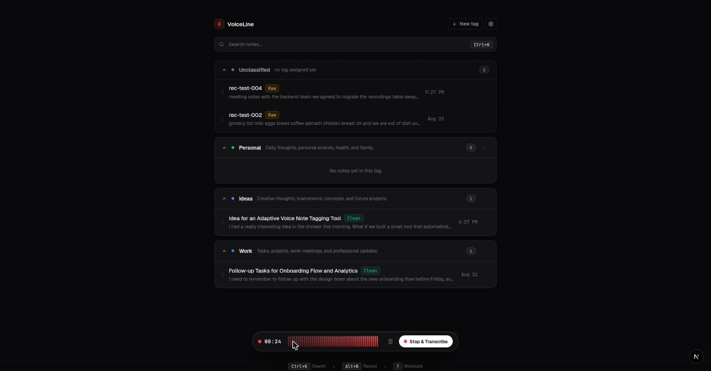
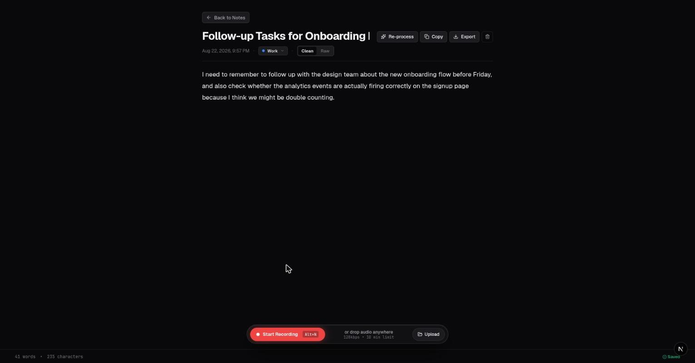

# VoiceLine

VoiceLine is a voice-note app: record or upload audio, get it transcribed automatically, and let AI clean it up — generating a title, summarizing long notes, and auto-tagging them into categories you define.

<p align="center">
  
  
</p>
<p align="center">
  
</p>

## How it works

1. **Record or upload** audio from the floating recorder dock.
2. **Transcribe** — audio is sent to OpenAI's transcription model and the raw transcript is stored.
3. **Process** — a second pass runs only the steps a note actually needs:
   - generates a title if one wasn't set
   - summarizes into bullet points if the transcript is long (500+ words)
   - assigns a tag from your existing tags, if the note doesn't already have one
4. **Organize** — notes are grouped by tag, with drag-and-drop to move notes between tags and full keyboard shortcut support.

Audio itself is not persisted — only the transcript, summary, title, and tag are stored in Postgres (`lib/recordings/drizzle-store.ts`), keeping storage text-first and ephemeral for audio.

## Tech stack

- [Next.js 16](https://nextjs.org) (App Router) + React 19
- [Drizzle ORM](https://orm.drizzle.team) + PostgreSQL
- [OpenAI API](https://platform.openai.com/docs) for transcription and processing
- [TanStack Query](https://tanstack.com/query) for server state
- [dnd-kit](https://dndkit.com) for drag-and-drop tag management
- [Zod](https://zod.dev) for schema validation (including structured AI output)

## Getting started

### 1. Install dependencies

```bash
npm install
```

### 2. Configure environment

Copy the example env file and fill in your values:

```bash
cp .example.env .env.local
```

| Variable | Description |
|---|---|
| `OPENAI_API_KEY` | Your OpenAI API key |
| `TRANSCRIBE_MODEL` | Model used for audio transcription (default: `gpt-4o-mini-transcribe`) |
| `PROCESSING_MODEL` | Model used for title/summary/tag generation (default: `gpt-4o-mini`) |
| `DATABASE_URL` | PostgreSQL connection string |

### 3. Set up the database

```bash
npm run db:push
```

This syncs the Drizzle schema (`lib/db/schema.ts` — `recordings` and `tags` tables) directly to your database.

### 4. Run the dev server

```bash
npm run dev
```

Open [http://localhost:3000](http://localhost:3000).

## Scripts

| Command | Description |
|---|---|
| `npm run dev` | Start the dev server |
| `npm run build` | Production build |
| `npm run start` | Start the production server |
| `npm run lint` | Run ESLint |
| `npm run db:push` | Push schema changes directly to the database |
| `npm run db:generate` | Generate SQL migration files from schema changes |

## Project structure

```
app/
  api/
    transcribe/            # audio -> transcript
    recordings/[id]/process # transcript -> title/summary/tag
    recordings/             # CRUD for notes
    tags/                   # CRUD for tags
  notes/[id]/               # note detail page
  page.tsx                  # main workspace

components/
  AudioRecorder.tsx         # floating recording dock
  TagGroup.tsx               # drag-and-drop tag rows
  TranscriptEditor.tsx       # note editing
  TagModals.tsx               # tag create/edit UI
  ui/                        # shared primitives (Button, Modal, Badge, ...)

lib/
  db/                       # Drizzle client + schema
  recordings/               # data access layer, types, constants
  validations/              # Zod schemas for AI structured output
  hooks/                    # TanStack Query hooks, keyboard shortcuts
  utils/                    # formatting, export helpers
```
